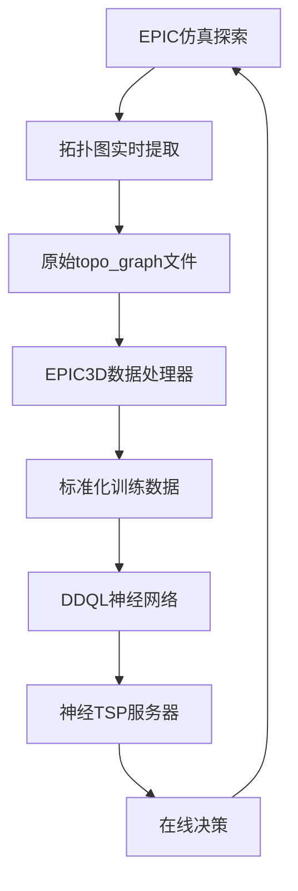

# EPIC 数据流水线：从拓扑图提取到神经网络输入

本文档详细描述了EPIC系统中从仿真数据采集到神经网络训练的完整数据处理流水线。

## 📋 目录

1. [数据流水线概览](#数据流水线概览)
2. [阶段1：仿真数据采集](#阶段1仿真数据采集)
3. [阶段2：拓扑图提取](#阶段2拓扑图提取)
4. [阶段3：数据处理与转换](#阶段3数据处理与转换)
5. [阶段4：神经网络输入格式](#阶段4神经网络输入格式)
6. [阶段5：模型训练与推理](#阶段5模型训练与推理)
7. [数据格式详解](#数据格式详解)
8. [配置参数说明](#配置参数说明)

---

## 数据流水线概览



---

## 阶段1：仿真数据采集

### 1.1 数据采集触发点

在 `fast_exploration_manager.cpp` 的 `planGlobalPath()` 函数中，有多个触发拓扑图提取的关键节点：

```cpp
// 情况1: 没有视点
if (viewpoints.empty()) {
    if (topo_extractor_) {
        topo_extractor_->extractTopoGraph("planGlobalPath_no_viewpoints");
    }
    return NO_FRONTIER;
}

// 情况2: 没有可达视点
if (viewpoint_reachable.empty()) {
    if (topo_extractor_) {
        topo_extractor_->extractTopoGraph("planGlobalPath_no_reachable");
    }
    return NO_FRONTIER;
}

// 情况3: 只有一个可达视点
if (viewpoint_reachable.size() == 1) {
    if (topo_extractor_) {
        topo_extractor_->extractTopoGraph("planGlobalPath_single_viewpoint");
    }
    return SUCCEED;
}

// 情况4: TSP求解完成后
if (topo_extractor_) {
    topo_extractor_->updateViewpointInfo(viewpoint_reachable, 
                                        viewpoint_reachable_distance2, 
                                        indices,
                                        viewpoint_benefits);
    topo_extractor_->extractTopoGraph("planGlobalPath_final");
}
```

### 1.2 采集的原始数据

- **拓扑图节点**: 位置、类型、状态信息
- **边连接关系**: 节点间的连通性和成本
- **视点信息**: TSP顺序、距离、收益评分
- **探索统计**: 当前探索状态和进度
- **时间戳**: 精确的时间信息用于序列构建

---

## 阶段2：拓扑图提取

### 2.1 TopoExtractorIntegrated 工作流程

```cpp
class TopoExtractorIntegrated {
    void extractTopoGraph(const std::string& context);
    void updateViewpointInfo(const std::vector<TopoNode::Ptr>& viewpoints,
                            const std::vector<double>& distances,
                            const std::vector<int>& tsp_indices,
                            const std::vector<ViewpointBenefit>& benefits);
};
```

### 2.2 生成的文件格式

**文件位置**: `/home/amax/EPIC/collected_data/{episode_name}/filtered_data/`

**文件命名**: `topo_graph_{timestamp}.txt`

**文件结构示例**:
```text
# EPIC Topo Graph Export - planGlobalPath_final 1756236078.343951
# Exploration Stats:
viewpoints_found: 5
viewpoints_reachable: 3
viewpoints_visited: 2
exploration_area: 125.5
exploration_efficiency: 0.85

# Nodes: node_id x y z yaw is_viewpoint is_current is_history region_id is_reachable tsp_order distance obs_score cluster_dist
0 10.5 20.3 1.2 0.0 0 1 0 1 1 -1 0.0 0.0 0.0
1 15.2 18.7 1.2 1.57 1 0 0 1 1 0 5.2 8.5 2.3
2 12.8 25.1 1.2 -0.78 1 0 0 1 1 1 7.8 7.2 1.8
3 18.5 22.4 1.2 2.14 1 0 0 1 0 -1 15.2 0.0 0.0

# Edges: edge_id from_node to_node weight is_reachable
0 0 1 5.2 1
1 0 2 7.8 1
2 1 2 4.5 1
3 0 3 15.2 0
```

---

## 阶段3：数据处理与转换

### 3.1 EPIC3DDataParser 解析流程

```python
class EPIC3DDataParser:
    def parse_topo_file(self, file_path: str) -> EPIC3DTimeStep:
        # 1. 提取时间戳
        timestamp = self._extract_timestamp(lines[0])
        
        # 2. 解析探索统计
        exploration_stats = self._parse_exploration_stats(lines)
        
        # 3. 解析图结构
        nodes, edges = self._parse_graph_data(lines)
        
        # 4. 提取视点信息
        viewpoints = self._extract_viewpoints(nodes)
        
        # 5. 构建轨迹信息
        trajectory_info = self._build_trajectory_info(nodes)
```

### 3.2 数据标准化处理

**节点特征标准化**:
```python
def _process_node_features(self, node: Dict) -> np.ndarray:
    features = np.zeros(self.node_feature_dim, dtype=np.float32)
    
    # 位置特征 (归一化到 [-1, 1])
    features[0:3] = node['position'] / self.position_scale
    
    # 角度特征 (归一化到 [-1, 1])
    features[3] = node['yaw'] / np.pi
    
    # 二进制特征
    features[4] = 1.0 if node['is_viewpoint'] else 0.0
    features[5] = 1.0 if node['is_current'] else 0.0
    
    # 距离和评分特征 (归一化)
    features[6] = node['distance'] / self.distance_scale
    features[7] = node['observation_score'] / self.observation_score_scale
    features[8] = node['cluster_distance'] / self.cluster_distance_scale
    
    return features
```

### 3.3 图结构构建

**邻接表构建**:
```python
def _build_adjacency_list(self, edges: List[Dict], max_nodes: int, k_size: int):
    adjacency_dict = defaultdict(list)
    
    # 构建邻接关系
    for edge in edges:
        if edge['is_reachable']:
            adjacency_dict[edge['from_node_id']].append(edge['to_node_id'])
            adjacency_dict[edge['to_node_id']].append(edge['from_node_id'])
    
    # 转换为固定大小的邻接表
    adj_list = np.full((max_nodes, k_size), -1, dtype=np.int64)
    for node_id in range(max_nodes):
        neighbors = adjacency_dict[node_id][:k_size]
        adj_list[node_id, :len(neighbors)] = neighbors
```

---

## 阶段4：神经网络输入格式

### 4.1 DDQL模型输入规格

**输入张量格式**:
```python
observation = [
    node_inputs,           # [B, N, node_dim] - 节点特征矩阵
    node_padding_mask,     # [B, 1, N] - 节点填充掩码
    current_index,         # [B, 1, 1] - 当前节点索引
    viewpoints,           # [B, max_viewpoints, 1] - 视点索引
    viewpoint_padding_mask, # [B, 1, max_viewpoints] - 视点填充掩码
    adj_list              # [B, N, K] - K近邻邻接表
]
```

### 4.2 批处理数据结构

**训练批次格式**:
```python
batch = {
    'states': {
        'node_inputs': torch.tensor,      # [B, T, N, node_dim]
        'node_padding_mask': torch.tensor, # [B, T, 1, N]
        'current_index': torch.tensor,     # [B, T, 1, 1]
        'viewpoints': torch.tensor,        # [B, T, max_viewpoints, 1]
        'viewpoint_padding_mask': torch.tensor, # [B, T, 1, max_viewpoints]
        'adj_list': torch.tensor          # [B, T, N, K]
    },
    'actions': torch.tensor,              # [B, T] - 选择的视点索引
    'rewards': torch.tensor,              # [B, T] - 奖励信号
    'dones': torch.tensor                 # [B, T] - 终止标志
}
```

---

## 阶段5：模型训练与推理

### 5.1 DDQL训练流程

```python
# 训练配置 (config.yaml)
algorithm: "DDQL"
model:
  embed_dim: 128
  node_dim: 9
data_processing:
  max_nodes: 500
  max_viewpoints: 100
  k_size: 20
  node_feature_dim: 9
ddql:
  T: 20                    # 扩散步数
  use_fixed_actions: false
  temperature: 1.0
```

### 5.2 在线推理服务

**neural_tsp_server.py 工作流程**:
```python
def handle_tsp_request(self, req):
    # 1. 提取ROS请求数据
    current_pos = [req.current_position.x, req.current_position.y, req.current_position.z]
    viewpoints = [(vp.x, vp.y, vp.z) for vp in req.viewpoints]
    
    # 2. 构建神经网络输入
    obs, padding_mask = self.construct_observation(current_pos, viewpoints)
    
    # 3. 模型推理
    with torch.no_grad():
        action_samples = self.model.sample(obs, padding_mask)
        next_viewpoint_idx = action_samples[0].cpu().numpy()
    
    # 4. 返回决策结果
    response.next_viewpoint_index = int(next_viewpoint_idx)
    return response
```

---

## 数据格式详解

### 节点特征维度 (node_feature_dim = 9)

| 维度 | 特征名称 | 数据类型 | 取值范围 | 描述 |
|------|----------|----------|----------|------|
| 0-2  | position | float32  | [-1, 1]  | 3D位置坐标 (归一化) |
| 3    | yaw      | float32  | [-1, 1]  | 航向角 (归一化) |
| 4    | is_viewpoint | float32 | {0, 1} | 是否为视点 |
| 5    | is_current | float32 | {0, 1} | 是否为当前位置 |
| 6    | distance | float32  | [0, 1]   | 到当前位置距离 (归一化) |
| 7    | observation_score | float32 | [0, 1] | 观测收益评分 (归一化) |
| 8    | cluster_distance | float32 | [0, 1] | 聚类中心距离 (归一化) |

### 数据集统计信息

**典型episode特征**:
- **时长**: 200-800个时间步
- **节点数量**: 50-200个节点/时间步
- **视点数量**: 5-50个视点/时间步
- **成功率**: 85-95% episode完成探索

**数据集规模**:
- **Episode数量**: 1000+ episodes
- **总时间步**: 500,000+ transitions  
- **存储大小**: ~2GB (HDF5格式)
- **处理时间**: ~30分钟 (全数据集)

---

## 配置参数说明

### 核心参数配置

**数据处理参数** (`config.yaml`):
```yaml
data_processing:
  max_nodes: 500           # 最大节点数限制
  max_viewpoints: 100      # 最大视点数限制  
  k_size: 20              # K近邻图连接数
  node_feature_dim: 9      # 节点特征维度
  position_scale: 100.0    # 位置归一化缩放
  distance_scale: 50.0     # 距离归一化缩放
  observation_score_scale: 50.0  # 观测评分归一化缩放
  cluster_distance_scale: 20.0   # 聚类距离归一化缩放
```

**模型参数** (`config.yaml`):
```yaml
model:
  embed_dim: 128          # GNN隐藏维度
  max_actions: 100        # 最大动作空间
  
ddql:
  T: 20                   # 扩散时间步数
  use_fixed_actions: false # 是否使用固定动作空间
  temperature: 1.0        # 采样温度
```

### ROS服务配置

**neural_tsp_server** 启动:
```bash
# 启动神经TSP服务
roslaunch exploration_manager cave.launch use_neural_tsp:=true

# 检查服务状态  
rosservice list | grep neural_tsp
```

**服务消息格式** (`NeuralTSP.srv`):
```
# 请求
geometry_msgs/Point current_position    # 当前位置
geometry_msgs/Point[] viewpoints        # 可达视点位置数组
int32[] viewpoint_indices               # 视点索引
---
# 响应  
bool success                            # 成功标志
int32 next_viewpoint_index             # 选择的视点索引
string message                          # 状态信息
```

---

## 数据质量保证

### 数据验证规则

1. **Episode完整性检查**:
   - 最后一帧 `viewpoints_visited == 0` (探索完成)
   - 时间序列连续性验证
   - 节点ID一致性检查

2. **数据一致性验证**:
   - 视点索引范围检查
   - 邻接表连通性验证
   - 特征值范围验证

3. **质量过滤标准**:
   - Episode长度 > 10个时间步
   - 成功完成探索的episode
   - 没有数据缺失或异常值

### 性能监控指标

- **数据处理速度**: ~100 episodes/分钟
- **存储效率**: ~2MB/episode (压缩后)
- **模型推理延迟**: <10ms/次决策
- **内存使用**: <4GB (训练时)

---

## 总结

这个数据流水线实现了从仿真探索到智能决策的完整闭环：

1. **实时采集**: 在关键决策点提取拓扑图状态
2. **离线处理**: 批量转换为标准化训练数据  
3. **模型训练**: 使用DDQL学习最优视点选择策略
4. **在线部署**: 通过ROS服务提供实时决策支持
5. **性能反馈**: 决策结果反馈到下一轮数据采集

整个系统设计保证了数据质量、处理效率和模型性能的统一，为EPIC自主探索系统提供了强大的学习能力。
